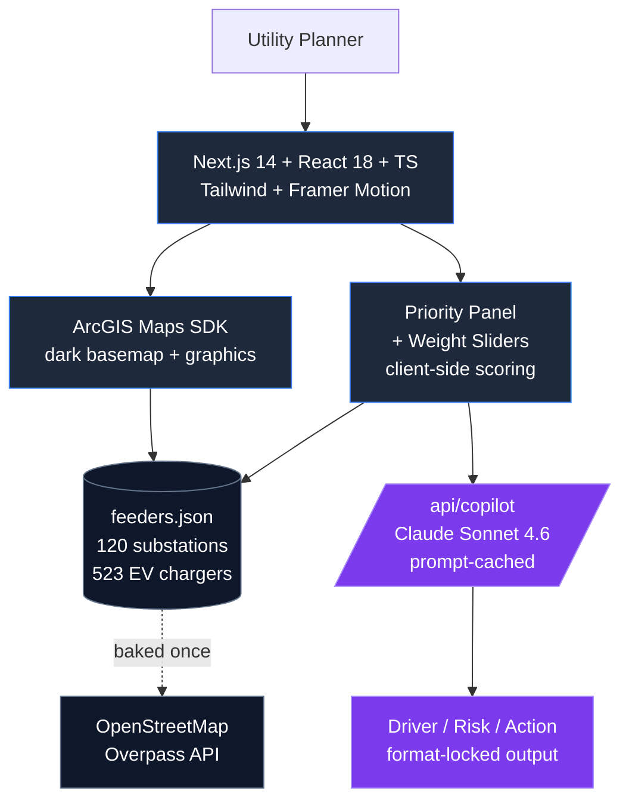

# GridFirst — Tech Stack Diagram

Two versions: ASCII for terminal/notes, Mermaid for the slide render.

---

## ASCII (for speaker notes / README)

```
┌──────────────────────────────────────────────────────────────┐
│                    USER (Utility Planner)                    │
└────────────────────────┬─────────────────────────────────────┘
                         │
         ┌───────────────▼────────────────┐
         │   Next.js 14 (App Router)      │
         │   React 18 + TypeScript        │
         │   Tailwind + Framer Motion     │
         └───────┬───────────────┬────────┘
                 │               │
   ┌─────────────▼──────┐   ┌────▼──────────────────┐
   │  ArcGIS Maps SDK   │   │  Priority Panel       │
   │  (dark basemap +   │   │  + Weight Sliders     │
   │   graphics layer)  │   │  (client-side scoring)│
   └─────────────┬──────┘   └────┬──────────────────┘
                 │               │
                 └───────┬───────┘
                         │
              ┌──────────▼──────────┐
              │  feeders.json       │  ← baked offline from
              │  120 substations    │     OpenStreetMap (Overpass)
              │  523 EV chargers    │     + heuristic scoring
              └──────────┬──────────┘
                         │
              ┌──────────▼──────────┐
              │  /api/copilot       │
              │  Claude Sonnet 4.6  │  ← Driver / Risk / Action
              │  (prompt cached)    │     format-locked output
              └─────────────────────┘
```

---

## Mermaid (for the slide — paste into Mermaid Live, export SVG)



---

## What each layer does (one-liners for Q&A)

| Layer | What it does | Why we chose it |
|---|---|---|
| **Next.js 14 (App Router)** | Server-rendered React app with API routes | Single-binary deploy on Vercel, no separate backend |
| **React 18 + TypeScript** | UI + typed contracts between scoring, panel, map | Catches feeder-shape bugs at compile time |
| **Tailwind CSS** | Dark monochrome UI with one blue accent | Planner-friendly, no design debt |
| **Framer Motion** | Smooth row-reorder animation when ranking changes | The slider-drag moneyshot needs to *feel* good |
| **ArcGIS Maps SDK** | Vector basemap + custom graphics for 120 feeders | Utilities already run Esri — drops into their stack |
| **OpenStreetMap (Overpass)** | Real Ontario substations + EV chargers, baked once | Free, public, real data — not synthetic |
| **Client-side scoring** | Weighted composite (climate × asset × load) | Sliders feel instant; no roundtrip latency |
| **Claude Sonnet 4.6** | Per-feeder Driver/Risk/Action explanations | Locked format = OEB-style explainability |
| **Prompt caching (`cache_control: ephemeral`)** | Sub-second copilot response across panel clicks | The 5-second wait would kill the demo |
